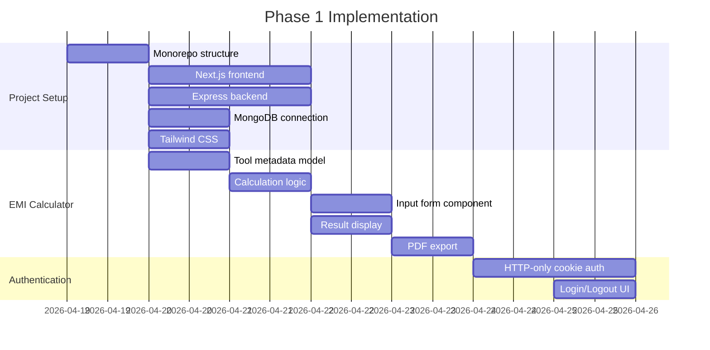

# SahakarHelp Tools Project Structure

```
SahakarHelp/
│
├── frontend/                # Next.js application (app router)
│   ├── public/              # Static assets
│   ├── src/
│   │   ├── app/             # App router directory
│   │   │   ├── (public)/    # Public routes
│   │   │   │   ├── page.js  # Homepage
│   │   │   │   └── tools/   # Tool routes
│   │   │   ├── (admin)/     # Admin routes
│   │   │   │   ├── page.js  # Admin dashboard
│   │   │   │   └── tools/   # Tool management
│   │   ├── components/      # UI components
│   │   ├── services/        # API service layer
│   │   ├── lib/             # Tool calculation logic
│   │   │   └── tools/       # Per-tool logic modules
│   │   ├── contexts/        # React contexts
│   │   └── styles/          # Tailwind config
│   ├── next.config.js
│   └── package.json
│
├── backend/                 # Express application
│   ├── config/              # Environment configs
│   ├── controllers/         # Route handlers
│   ├── services/            # Business logic
│   ├── models/              # MongoDB schemas
│   │   └── ToolMetadata.js  # Tool definition model
│   ├── routes/              # API endpoints
│   ├── middleware/          # Auth & validation
│   │   ├── auth.js          # HTTP-only cookie auth
│   │   └── errorHandler.js  # Error middleware
│   ├── validators/          # Request validators
│   ├── utils/               # Helper functions
│   │   └── logger.js        # Logging system
│   ├── server.js            # Entry point
│   └── package.json
│
├── shared/                  # Shared resources
│   └── schemas/             # Validation schemas
│
├── .env.example             # Environment template
├── .gitignore
└── README.md                # Setup instructions
```

## Initial Implementation Plan

We'll focus on Phase 1: Basic setup + EMI Calculator



## Key Architecture Decisions

1. **HTTP-only Cookie Authentication**:
   - More secure than localStorage for JWT tokens
   - Protected against XSS attacks
   - Requires same-site and secure flags

2. **Modular Tool System**:
   ```mermaid
   classDiagram
     class ToolComponent {
       +inputs: FormData
       +calculate()
       +renderResult()
       +exportPDF()
     }
     class EMICalculator {
       +principal: number
       +rate: number
       +tenure: number
       +calculateEMI()
     }
     ToolComponent <|-- EMICalculator
   ```

3. **Error Handling**:
   - Centralized error middleware
   - Logging to file and console
   - Custom error classes for API errors