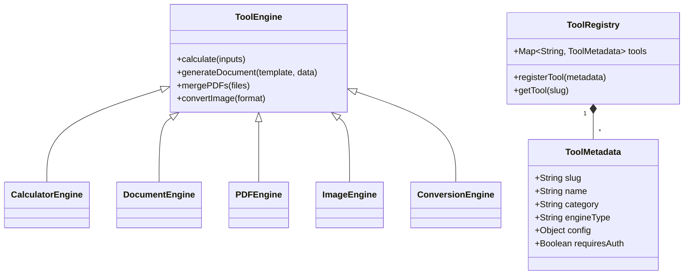

# SahakarHelp Tools - Multi-Engine Architecture

## Core Architecture



## Engine Types

1. **CalculatorEngine**
   - For mathematical operations
   - Example: EMI Calculator
   - Input: JSON parameters
   - Output: Calculation results

2. **DocumentEngine**
   - Generates documents from templates
   - Example: Resume Generator
   - Uses: PDFKit, DocxTemplates

3. **PDFEngine**
   - PDF manipulation tools
   - Example: PDF Merge
   - Uses: PDF-Lib

4. **ImageEngine**
   - Image processing tools
   - Example: Image Converter
   - Uses: Sharp

5. **ConversionEngine**
   - Data format conversion
   - Example: JSON to XML

## Implementation Plan

### Phase 1: Core System

1. **Tool Metadata Model**
```javascript
// backend/models/ToolMetadata.js
{
  slug: { type: String, unique: true },
  name: { type: String, required: true },
  category: { type: String, required: true },
  engineType: { 
    type: String,
    enum: ['calculator', 'document', 'pdf', 'image', 'conversion'],
    required: true
  },
  config: { type: Object },
  requiresAuth: { type: Boolean, default: false }
}
```

2. **Tool Registry Service**
```javascript
// backend/services/ToolRegistry.js
class ToolRegistry {
  constructor() {
    this.tools = new Map();
  }

  registerTool(metadata) {
    this.tools.set(metadata.slug, metadata);
  }

  getTool(slug) {
    return this.tools.get(slug);
  }
}
```

3. **Dynamic Routing**
```javascript
// backend/routes/tools.js
router.post('/:slug', async (req, res) => {
  const tool = toolRegistry.getTool(req.params.slug);
  
  if (!tool) return res.status(404).json({ error: 'Tool not found' });

  try {
    let result;
    switch(tool.engineType) {
      case 'calculator':
        result = await calculatorEngine.execute(tool, req.body);
        break;
      case 'document':
        result = await documentEngine.generate(tool, req.body);
        break;
      // Other engine cases...
    }
    
    res.json(result);
  } catch (error) {
    res.status(500).json({ error: error.message });
  }
});
```

### Phase 2: Frontend Implementation

1. **Dynamic Tool Loader**
```javascript
// frontend/src/components/ToolLoader.js
const ToolLoader = ({ slug }) => {
  const [toolConfig, setToolConfig] = useState(null);

  useEffect(() => {
    fetch(`/api/tools/${slug}/config`)
      .then(res => res.json())
      .then(data => setToolConfig(data));
  }, [slug]);

  if (!toolConfig) return <Loading />;

  return (
    <div>
      <h1>{toolConfig.name}</h1>
      {toolConfig.engineType === 'calculator' && <CalculatorUI config={toolConfig} />}
      {toolConfig.engineType === 'document' && <DocumentUI config={toolConfig} />}
    </div>
  );
};
```

2. **Engine-Specific UI Components**
- CalculatorUI: Input fields + result display
- DocumentUI: Form builder + preview

## Initial Tools Implementation

| Tool | Slug | Engine | Description |
|------|------|--------|-------------|
| EMI Calculator | `emi-calculator` | calculator | Calculates loan EMIs |
| PDF Merge | `pdf-merge` | pdf | Merges multiple PDFs |
| Resume Generator | `resume-generator` | document | Creates resumes from templates |

## Next Steps
1. Implement core engine interfaces
2. Create MongoDB migration for ToolMetadata
3. Build admin interface for tool registration
4. Develop generic UI components per engine type